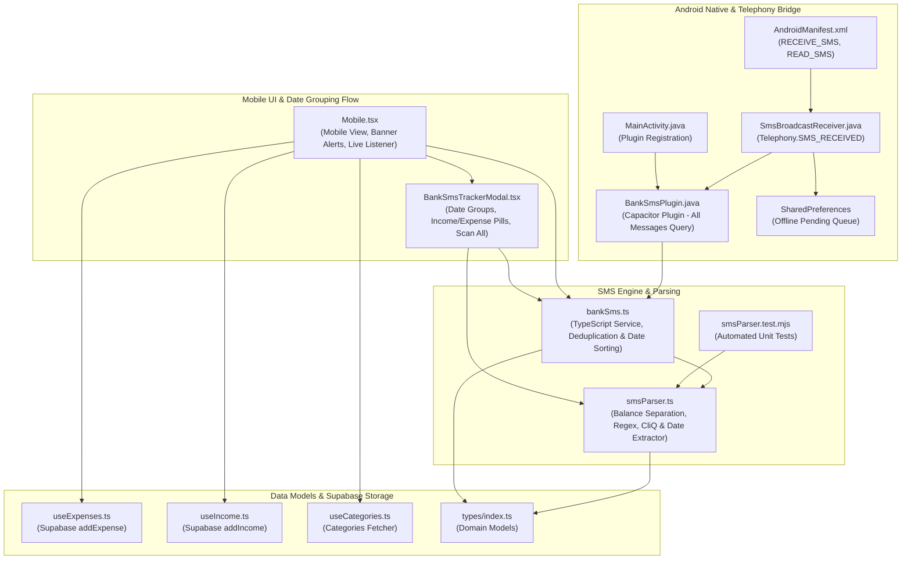

# Knowledge Graph Report: Bank SMS Auto-Tracking by Date
*Generated via Graphify knowledge graph tracking standard*

## 1. Executive Summary

This report documents the **Bank SMS Auto-Tracking** architecture for **Pocket Expenses**, updated with:
1. **Full Inbox Scanning**: Ability to scan all device SMS messages without time cutoff.
2. **Reverse Chronological Date Grouping**: Scanned bank transactions are grouped and organized by date with daily totals for income and expenses.
3. **Dual Expense & Income Support**:
   - Debits / Purchases are saved to Supabase `expenses` via `onSaveExpense`.
   - Credits / CliQ transfers / Deposits are saved to Supabase `income` via `onSaveIncome`.
4. **Jordanian Bank SMS Format Specialization**:
   - Support for `JOD6.200` without spaces.
   - Isolation and extraction of `Available balance` / `Balance` so balance figures are never confused with transaction amounts.
   - Extraction of party names from CliQ transfers (`from KHALED ISSA SABRI ABU QUTISH as CliQ transfer`).
   - Extraction of merchant names (`from UNCLE OSAKA ALRABIEH has been debited`).
   - Account and card ending extraction (`XXXX5061`, `0145*500` -> `5061`, `500`).
   - Relative dates (`08/09 01:22` -> `2026-09-08`).

---

## 2. Core Architecture & Communities

---

## 3. Jordanian Bank Message Formats Supported

| Bank Message Example | Type | Extracted Amount | Extracted Merchant / Party | Date | Card / Acct | Balance |
| :--- | :---: | :---: | :---: | :---: | :---: | :---: |
| `JOD6.200 has been credited to 0145*500from KHALED ISSA SABRI ABU QUTISH as CliQ transfer Balance 923.186JOD` | **Income** | **6.200 JOD** | KHALED ISSA SABRI ABU QUTISH (CliQ) | Today | •500 | 923.186 JOD |
| `30.000 JOD has been credited to your account on 08/09 01:22. Available balance 47.744 JOD.` | **Income** | **30.000 JOD** | Account Deposit | 2026-09-08 | Account | 47.744 JOD |
| `A purchase transaction of 4.000 JOD from UNCLE OSAKA ALRABIEH has been debited from your card XXXX5061 on 06-09-2026. Available balance 17.744 JOD.` | **Expense** | **4.000 JOD** | UNCLE OSAKA ALRABIEH | 2026-09-06 | •5061 | 17.744 JOD |

---

## 4. Date Grouping & Review Flow

1. **Inbox Scanning**:
   - The user taps **Scan All Bank Messages**.
   - `BankSmsPlugin.getRecentSms({ days: 0, limit: 500 })` fetches all device SMS messages.
2. **Filtering & Deduplication**:
   - Financial messages are matched and checked against `processed_sms_ids` in `localStorage` to avoid re-prompting already imported entries.
3. **Date Organization**:
   - Messages are sorted chronologically and grouped into date buckets (`Today — Tuesday, Sep 8, 2026`, `Sunday, Sep 6, 2026`, etc.).
   - Each date group displays daily totals:
     - `+36.200 JOD Income` (Green)
     - `-4.000 JOD Expenses` (Red)
4. **Interactive Action**:
   - Users can filter by **All**, **Expenses**, or **Income**.
   - Single tap **Save Expense** or **Save Income**, or **Save All** in one tap.

---

## 5. Verification & Test Suite

- Automated Unit Tests: `16/16` tests passed (`tests/analytics.test.mjs` and `tests/smsParser.test.mjs`).
- Clean TypeScript & Vite build: `npm run build` passed with zero errors.
- Standalone Release APK: `artifacts/pocket-expenses.apk` compiled and signed.
