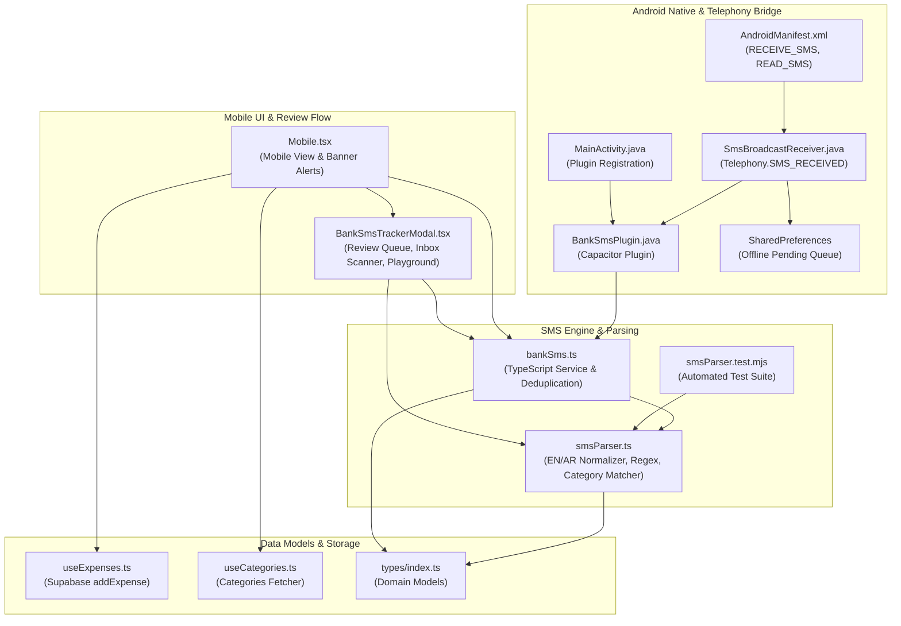

# Knowledge Graph Report: Bank SMS Expense Auto-Tracking
*Generated via Graphify knowledge graph tracking standard*

## 1. Executive Summary

This knowledge graph report documents the architecture and implementation of the **Bank SMS Auto-Tracking** system for the **Pocket Expenses** Android APK. The system allows users to automatically track household and personal expenses directly from bank SMS transaction alerts (such as card purchases, POS terminals, ATM withdrawals, and CliQ transfers) received in English and Arabic.

---

## 2. Core Architecture & Communities

### Community Breakdown:
1. **`c1_mobile_ui` (Mobile UI & Review Flow)**:
   - [`Mobile.tsx`](file:///C:/Users/User/Documents/expense_tracker/src/pages/Mobile.tsx): Standalone mobile dashboard entry point. Listens to incoming SMS events in real-time, queries background pending queues on resume, renders pending alert badges, and saves approved transactions.
   - [`BankSmsTrackerModal.tsx`](file:///C:/Users/User/Documents/expense_tracker/src/components/BankSmsTrackerModal.tsx): Interactive drawer/modal providing 4 tabs:
     - **Pending Review**: Edit merchant, amount, category, and visibility before saving. Bulk "Save All" action.
     - **Inbox Scan**: Scans device SMS inbox for historical bank transactions (last 7, 14, or 30 days).
     - **Settings**: Toggle between "Review Before Saving" and "Zero-Click Auto-Save", set default visibility.
     - **Test Parser**: Live testing playground with sample SMS messages from Jordan/international banks.

2. **`c2_sms_engine` (SMS Engine & Parsing)**:
   - [`smsParser.ts`](file:///C:/Users/User/Documents/expense_tracker/src/lib/smsParser.ts): Handles bilingual parsing (English + Arabic). Normalizes Eastern Arabic numerals (`٠-٩`), extracts amounts and currencies (`JOD`, `USD`, `EUR`, `SAR`, etc.), parses merchant and recipient names, filters OTP/security alerts, and matches categories.
   - [`bankSms.ts`](file:///C:/Users/User/Documents/expense_tracker/src/lib/bankSms.ts): TypeScript wrapper for Capacitor's native bridge, managing `localStorage` settings, deduplication (`processed_sms_ids`), and lifecycle subscriptions.
   - [`smsParser.test.mjs`](file:///C:/Users/User/Documents/expense_tracker/tests/smsParser.test.mjs): Unit tests covering Arab Bank, Etihad Bank, Jordan Kuwait Bank (Manaseer fuel), CliQ transfers, and OTP rejection.

3. **`c3_android_native` (Android Native & Telephony Bridge)**:
   - [`AndroidManifest.xml`](file:///C:/Users/User/Documents/expense_tracker/android/app/src/main/AndroidManifest.xml): Declares `RECEIVE_SMS` and `READ_SMS` permissions and registers `SmsBroadcastReceiver`.
   - [`SmsBroadcastReceiver.java`](file:///C:/Users/User/Documents/expense_tracker/android/app/src/main/java/com/householdledger/expenses/SmsBroadcastReceiver.java): Catches `Telephony.Sms.Intents.SMS_RECEIVED_ACTION`. Queues messages in `SharedPreferences` if app is backgrounded and forwards to `BankSmsPlugin` if active.
   - [`BankSmsPlugin.java`](file:///C:/Users/User/Documents/expense_tracker/android/app/src/main/java/com/householdledger/expenses/BankSmsPlugin.java): Capacitor Plugin handling runtime permissions, `content://sms/inbox` queries, background queue flushing, and event dispatching.
   - [`MainActivity.java`](file:///C:/Users/User/Documents/expense_tracker/android/app/src/main/java/com/householdledger/expenses/MainActivity.java): Registers the plugin in `onCreate()`.

4. **`c4_core_data` (Data Models & Storage)**:
   - [`useExpenses.ts`](file:///C:/Users/User/Documents/expense_tracker/src/hooks/useExpenses.ts): Inserts expenses into Supabase with `account_type: 'bank'`.
   - [`useCategories.ts`](file:///C:/Users/User/Documents/expense_tracker/src/hooks/useCategories.ts): Supplies user categories for keyword-based matching.

---

## 3. Key God Nodes & Connectivity

| Node | Type | Degree (In/Out) | Primary Role |
| :--- | :--- | :---: | :--- |
| [`src/pages/Mobile.tsx`](file:///C:/Users/User/Documents/expense_tracker/src/pages/Mobile.tsx) | Page | 5 | Central hub for mobile UX, event handling, and expense persistence. |
| [`src/lib/bankSms.ts`](file:///C:/Users/User/Documents/expense_tracker/src/lib/bankSms.ts) | Service | 6 | Bridges JavaScript web runtime with Android Capacitor native code. |
| [`src/lib/smsParser.ts`](file:///C:/Users/User/Documents/expense_tracker/src/lib/smsParser.ts) | Utility | 4 | Pure extraction engine for English & Arabic bank SMS alerts. |
| [`BankSmsPlugin.java`](file:///C:/Users/User/Documents/expense_tracker/android/app/src/main/java/com/householdledger/expenses/BankSmsPlugin.java) | Native Plugin | 4 | Native bridge for Android telephony, permissions, and background dispatch. |

---

## 4. End-to-End Data Flow

### A. Real-Time Incoming SMS:
1. Bank sends SMS alert to the phone.
2. Android OS fires `android.provider.Telephony.SMS_RECEIVED`.
3. `SmsBroadcastReceiver` extracts originating address, message body, and timestamp.
4. If the app is active, `BankSmsPlugin.notifyIncomingSms()` emits `smsReceived` to Capacitor webview.
5. If the app is closed or backgrounded, the SMS is stored in `SharedPreferences` (`PocketExpensesSmsPrefs`).
6. When the app resumes or mounts, `fetchPendingBackgroundTransactions()` reads and flushes the queue.
7. Depending on user preference:
   - **Auto Mode**: Automatically logs expense into Supabase via `addExpense` with toast feedback.
   - **Review Mode**: Appends transaction to the review queue and displays a badge/banner on `Mobile.tsx`.

### B. Historical Inbox Backfill:
1. User clicks "Scan SMS Inbox" (e.g. Last 7, 14, or 30 days).
2. `BankSmsPlugin.getRecentSms()` queries Android's `Telephony.Sms.Inbox` provider.
3. Messages are cross-checked against `processed_sms_ids` in `localStorage` to prevent duplicate imports.
4. Filtered transactions are presented in the Review tab for 1-click confirmation or bulk saving.

---

## 5. Verification & Tests

- **Unit Tests**: `node --test tests/smsParser.test.mjs`
  - Arabic numerals normalization (`١٢٣.٤٥` -> `123.45`): **PASSED**
  - English bank SMS (Etihad / Arab Bank / Card ending / Balances): **PASSED**
  - Arabic bank SMS (Arab Bank / Housing Bank / Jordan): **PASSED**
  - Fuel & Transport SMS (Manaseer gas station): **PASSED**
  - OTP & Security 2FA filtering: **PASSED**
  - Salary & Inward credit filtering: **PASSED**
- **TypeScript & Vite Build**: Passed cleanly with zero compilation errors.

---

## 6. How Another Agent Can Extend This System

1. **Adding Bank Templates**:
   Update `CATEGORY_RULES` or merchant pattern matchers in [`src/lib/smsParser.ts`](file:///C:/Users/User/Documents/expense_tracker/src/lib/smsParser.ts). Add test cases in [`tests/smsParser.test.mjs`](file:///C:/Users/User/Documents/expense_tracker/tests/smsParser.test.mjs).
2. **Income SMS Auto-Tracking**:
   Currently, expense transactions are tracked by default (`type === 'expense'`). The parser already extracts `type === 'income'`. To auto-log income, extend `bankSms.ts` and `useIncome.ts` to call `addIncome`.
3. **Compiling APK**:
   Run `npm run android:apk` to sync assets and trigger `./gradlew assembleRelease` to generate the final signed APK in `artifacts/pocket-expenses.apk`.
